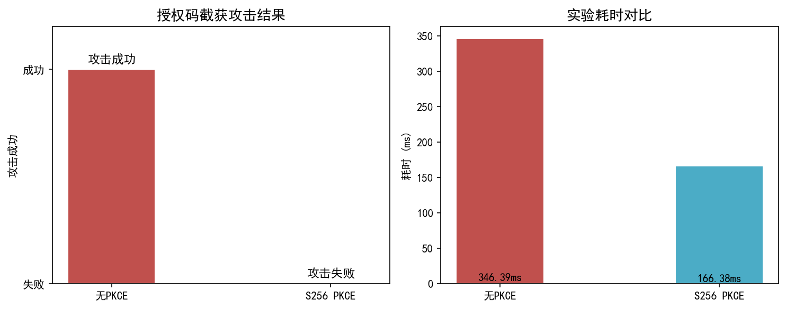
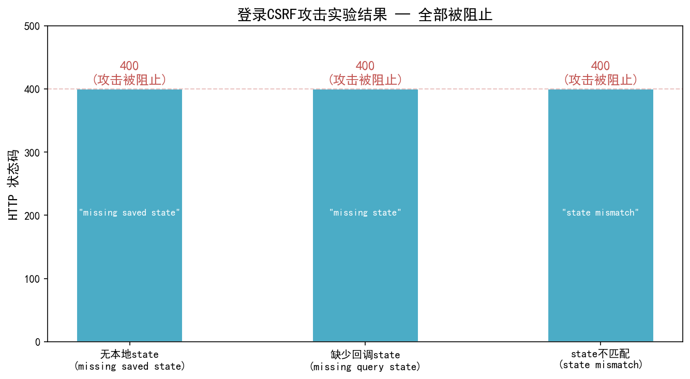
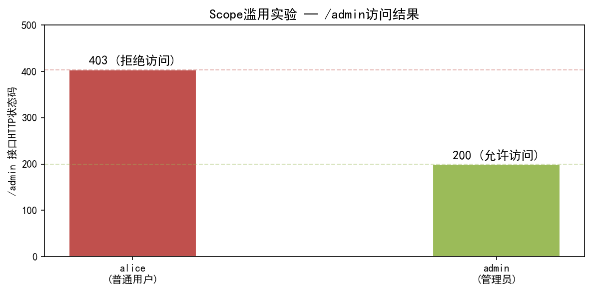
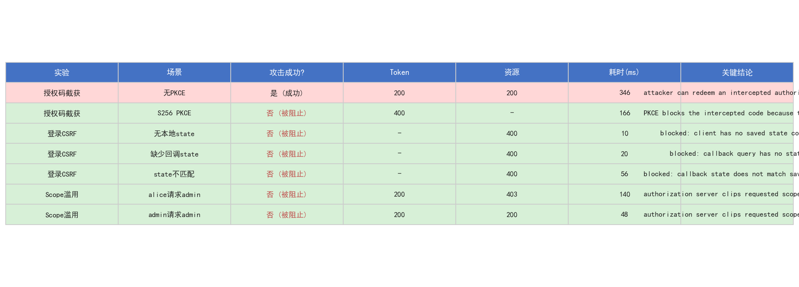

# 第5章 攻击与防御实验

## 5.1 实验目标

本章旨在系统性地验证基于 OAuth 2.0 授权码模式的 Web 身份认证系统在面临常见攻击手段时的安全性表现。通过对三类典型攻击场景的模拟——授权码截获攻击、登录 CSRF 攻击和 Scope 权限滥用攻击——分别在不启用和启用对应防御机制的条件下进行对照实验，量化评估 PKCE（Proof Key for Code Exchange）、state 参数绑定以及 Scope 裁剪与双重校验机制的防护效果。

实验的核心理念是"以攻促防"：通过模拟攻击者的视角构造恶意请求，观察系统在有无防御条件下的响应差异，从而为第6章的 PKCE 调优建议和第7章的安全设计总结提供数据支撑。

## 5.2 实验环境与配置

### 5.2.1 系统拓扑

实验系统由三个本地服务组成，均运行于单机环境：

| 服务 | 地址 | 职责 |
|------|------|------|
| Authorization Server | `http://127.0.0.1:8000` | 用户认证、授权码签发、Token 签发 |
| Client App | `http://127.0.0.1:8001` | 发起授权请求、接收回调、展示结果 |
| Resource Server | `http://127.0.0.1:8002` | 受保护资源接口、Token 校验、权限判定 |

### 5.2.2 实验账号

| 账号 | 密码 | Role | Allowed Scopes |
|------|------|------|----------------|
| alice | alice123 | user | read:profile read:email |
| admin | admin123 | admin | read:profile read:email admin:panel |

### 5.2.3 实验工具

所有攻击实验通过 `attack_simulator/` 模块中的黑盒测试脚本自动化执行。脚本使用 Python `httpx` 库模拟 HTTP 客户端，不依赖浏览器 UI，确保实验的可重复性和结果的一致性。每个实验记录以下指标：

- `attack_success`：攻击是否成功（布尔值）
- `token_status`：`/token` 接口 HTTP 状态码
- `resource_status`：资源接口或回调接口 HTTP 状态码
- `elapsed_ms`：实验耗时（毫秒）
- `reason`：结果解释
- `evidence`：关键证据（错误信息、granted scope 等）

## 5.3 实验一：授权码截获攻击

### 5.3.1 攻击原理

在 OAuth 2.0 授权码模式中，客户端通过浏览器重定向从授权服务器获取 `authorization_code`，随后使用该 code 向 `/token` 端点换取 `access_token`。如果攻击者能够通过中间人攻击、恶意浏览器插件或日志泄露等途径截获 authorization code，且系统未启用 PKCE 机制，则攻击者可以直接使用截获的 code 向 `/token` 端点发起请求，冒用受害者身份获取合法的 access token。

攻击流程如下：

1. 受害者正常发起授权请求，输入用户名和密码完成认证
2. 授权服务器通过 302 重定向将 `code` 返回给客户端
3. 攻击者在重定向 URL 中截获 `code`
4. 攻击者直接使用截获的 `code` 调用 `/token` 端点
5. 攻击者获取 `access_token`，进而访问受保护资源

### 5.3.2 实验设计

本实验设计两组对照：

- **无 PKCE 组**：客户端不携带 `code_challenge` 参数发起授权请求，攻击者截获 `code` 后直接调用 `/token`
- **S256 PKCE 组**：客户端在授权请求中携带 `code_challenge`（基于 SHA-256 哈希生成），攻击者截获 `code` 后尝试在缺少 `code_verifier` 的条件下调用 `/token`

### 5.3.3 实验结果

| 实验场景 | 防御方案 | 攻击成功 | Token状态 | 资源状态 | 耗时(ms) |
|----------|----------|----------|-----------|----------|----------|
| 授权码截获 | 无PKCE | ✓ 成功 | 200 | 200 | 346.39 |
| 授权码截获 | S256 PKCE | ✗ 失败 | 400 | - | 166.38 |

**无 PKCE 时**：攻击者使用截获的 authorization code 成功从 `/token` 端点换取了有效 access token（HTTP 200），并使用该 token 成功访问了 `/profile` 接口（HTTP 200）。攻击完全成功。

**启用 S256 PKCE 时**：攻击者使用截获的 authorization code 调用 `/token` 时，授权服务器返回 HTTP 400 错误，错误信息为 `"invalid_code_verifier"`。攻击失败。而合法客户端携带正确的 `code_verifier` 调用 `/token` 时，成功换取 token（HTTP 200）。

### 5.3.4 结果分析

实验结果表明，单纯依赖 authorization code 的机密性无法有效防止授权码截获攻击。OAuth 2.0 规范中 authorization code 作为不记名凭证（bearer token），任何持有该 code 的实体都可以在 `/token` 端点兑换 access token。PKCE 机制通过在授权请求阶段绑定 `code_challenge`，在令牌交换阶段要求提交匹配的 `code_verifier`，有效地打破了这一攻击路径。即使攻击者截获了 authorization code，由于缺少只有合法客户端才知道的 `code_verifier`，无法完成令牌交换。

## 5.4 实验二：登录 CSRF 攻击

### 5.4.1 攻击原理

登录 CSRF（Cross-Site Request Forgery）攻击利用了 OAuth 流程中客户端与授权服务器之间的状态同步漏洞。攻击者可以构造一个恶意的回调请求，诱骗受害者浏览器访问携带攻击者控制的 authorization code 的回调 URL。如果客户端未严格校验 state 参数，攻击者就能将自己的授权会话绑定到受害者的客户端会话中，使受害者在使用客户端时无意中访问攻击者的资源，或反之将受害者的授权凭证泄露给攻击者。

### 5.4.2 实验设计

本实验模拟三种 CSRF 攻击变体：

1. **无本地 state**：客户端未保存 state cookie，回调请求携带有效 state（模拟服务端状态丢失）
2. **缺少回调 state**：客户端保存了 state cookie，但回调请求的 URL 中未携带 `state` 参数
3. **state 不匹配**：回调请求携带攻击者构造的 `state`，与客户端保存的 `state` 不一致

### 5.4.3 实验结果

| 实验场景 | 防御方案 | 攻击成功 | 回调状态 | 耗时(ms) |
|----------|----------|----------|----------|----------|
| 登录CSRF | 无本地state | ✗ 失败 | 400 | 9.52 |
| 登录CSRF | 缺少回调state | ✗ 失败 | 400 | 20.18 |
| 登录CSRF | state不匹配 | ✗ 失败 | 400 | 55.67 |

三种攻击变体均被成功阻止，回调接口返回 HTTP 400，具体错误信息分别为：

- 无本地 state：`"missing saved state"`
- 缺少回调 state：`"missing state"`
- state 不匹配：`"state mismatch"`

### 5.4.4 结果分析

state 参数是 OAuth 2.0 规范中推荐的 CSRF 防护机制。本实验中客户端在 `/login` 阶段生成随机 state 值，将其同时写入 HttpOnly cookie（服务端）和授权请求参数（客户端），在 `/callback` 阶段严格比对两组 state 值。实验结果显示，当前的 state 校验机制能够有效防御登录 CSRF 攻击。state 绑定确保了授权请求与回调请求之间的一一对应关系，攻击者无法通过伪造回调请求劫持用户的授权会话。

## 5.5 实验三：Scope 权限滥用攻击

### 5.5.1 攻击原理

在 OAuth 2.0 中，`scope` 参数定义了客户端请求的权限范围。一个常见的安全隐患是：客户端可能故意或无意地请求超出用户实际权限的 scope（如普通用户请求 `admin:panel` 权限）。如果授权服务器未对请求的 scope 进行过滤，就可能发生权限提升攻击。此外，即使授权服务器正确裁剪了 scope，资源服务器仍需要独立执行权限校验，形成纵深防御。

### 5.5.2 实验设计

本实验设置两组场景：

1. **alice（普通用户）请求 admin:panel**：普通用户 `alice` 的 `allowed_scopes` 为 `read:profile read:email`，但在授权请求中额外申请 `admin:panel`
2. **admin（管理员）请求 admin:panel**：管理员 `admin` 的 `allowed_scopes` 包含 `admin:panel`，授权请求中也申请了该 scope

两组场景均观察授权服务器是否正确过滤 scope，以及资源服务器的 `/admin` 接口是否正确执行访问控制。

### 5.5.3 实验结果

| 实验场景 | 用户 | Token状态 | /admin状态 | 攻击成功 | Granted Scope |
|----------|------|-----------|------------|----------|---------------|
| Scope滥用 | alice | 200 | 403 | ✗ 失败 | read:profile read:email |
| Scope滥用 | admin | 200 | 200 | - | read:profile read:email admin:panel |

**alice 场景**：授权服务器虽然签发了 token（HTTP 200），但 granted scope 被裁剪为 `read:profile read:email`，未包含 `admin:panel`。alice 使用该 token 访问 `/admin` 接口时，资源服务器返回 HTTP 403，错误信息为 `"missing scope: admin:panel"`。攻击失败。

**admin 场景**：授权服务器签发的 token 正确包含了 `admin:panel` scope。admin 使用该 token 访问 `/admin` 接口时，资源服务器返回 HTTP 200，响应体为 `"admin access granted"`。管理员正常访问。

### 5.5.4 结果分析

授权服务器的 scope 裁剪机制在此次实验中发挥了第一道防线的作用：即使客户端请求了超出用户权限的 scope，授权服务器也会按照 `allowed_scopes` 进行交集运算，只授予用户实际拥有的权限。资源服务器的 role + scope 双重校验构成了第二道防线：`/admin` 接口要求 `role == "admin"` 且 scope 包含 `admin:panel`，即使授权服务器出现漏洞，资源服务器仍能独立阻止越权访问。这种纵深防御策略有效防止了权限提升攻击。

## 5.6 攻击防御机制总结

综合三类实验结果，本系统的安全防护体系可归纳为三层防御：

| 防御层 | 防护机制 | 防御的攻击类型 | 实现位置 |
|--------|----------|----------------|----------|
| 第一层 | PKCE (S256) | 授权码截获 | Authorization Server `/token` |
| 第二层 | State 绑定 | 登录 CSRF | Client App `/callback` |
| 第三层 | Scope裁剪 + Role/Scope双重校验 | 权限提升/Scope滥用 | Authorization Server + Resource Server |

三层防御机制协同工作，形成了完整的纵深防御体系。实验数据证明：在三层防御全部启用的条件下，授权码截获攻击、登录 CSRF 攻击和 Scope 权限滥用攻击均被成功阻止，攻击成功率为 0。
