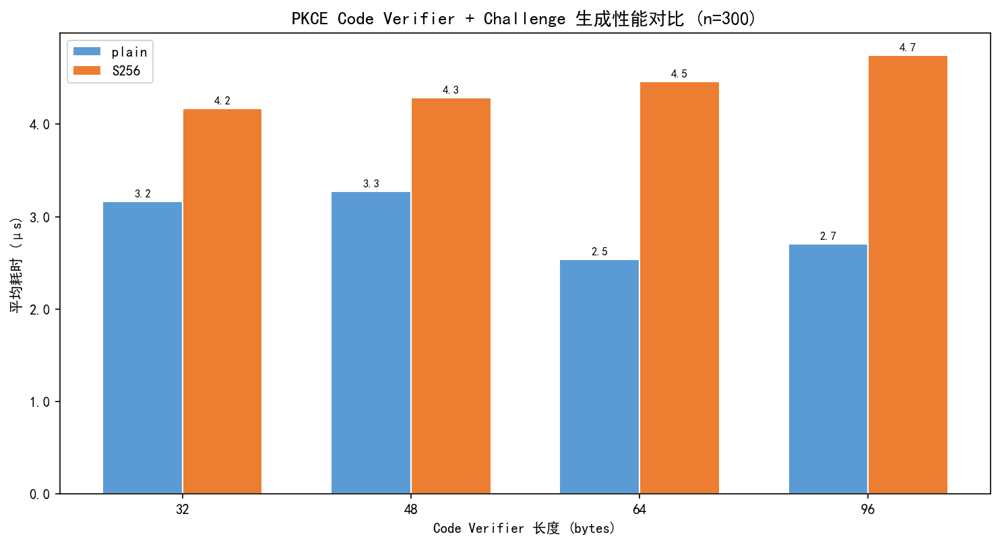
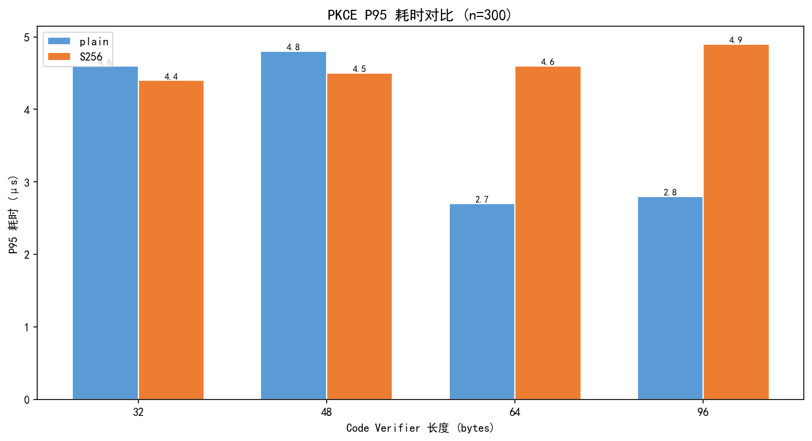
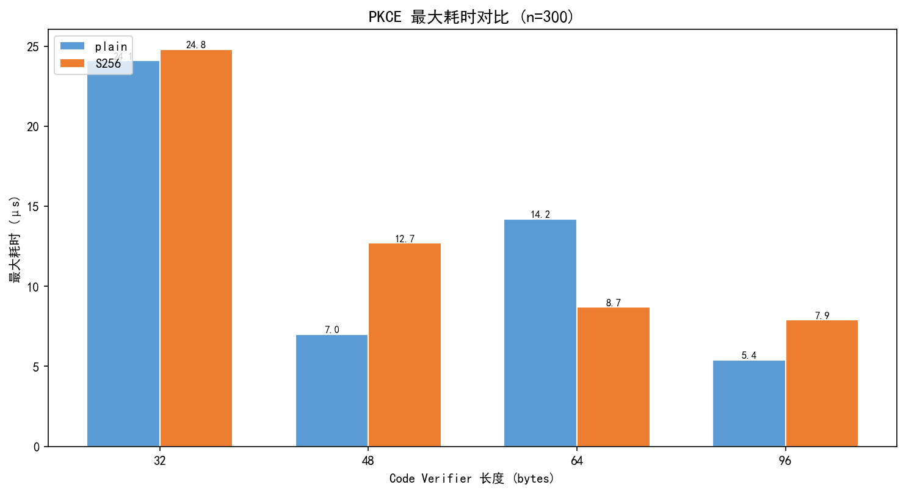
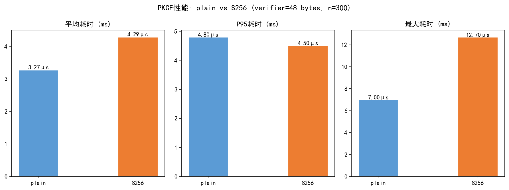

# 第6章 PKCE 调优实验

## 6.1 实验目标

PKCE（Proof Key for Code Exchange，发音为"pixy"）是 OAuth 2.0 授权码模式的扩展机制，最初设计用于保护移动和原生应用中的授权码流，后被 RFC 7636 标准化[1]。PKCE 通过在授权请求中绑定一个密码学挑战（code_challenge），并在令牌交换阶段验证对应的验证器（code_verifier），有效防止授权码截获攻击。

本章对 PKCE 机制的两种方法（`plain` 和 `S256`）以及不同 code_verifier 长度（32、48、64、96 bytes）进行系统的性能对比测试，目标是为课程项目系统选择最优的 PKCE 配置方案，在安全性和性能之间取得最佳平衡。

## 6.2 PKCE 机制原理

### 6.2.1 工作流程

PKCE 的标准工作流程包含以下步骤：

1. **客户端生成 code_verifier**：一个高熵随机字符串
2. **客户端计算 code_challenge**：
   - `plain` 方法：`code_challenge = code_verifier`
   - `S256` 方法：`code_challenge = BASE64URL-ENCODE(SHA256(ASCII(code_verifier)))`
3. **授权请求**：客户端在 `/authorize` 请求中携带 `code_challenge` 和 `code_challenge_method`
4. **授权服务器存储**：将 `code_challenge` 和 `code_challenge_method` 与 authorization code 关联
5. **令牌交换**：客户端在 `/token` 请求中提交 `code_verifier`
6. **授权服务器验证**：计算 `code_verifier` 对应的 `code_challenge`，与步骤 4 中存储的值比对

### 6.2.2 plain 与 S256 方法对比

| 特性 | plain | S256 |
|------|-------|------|
| 变换方式 | 无变换，直接比对 | SHA-256 哈希变换 |
| 安全性 | 低——code_verifier 以明文传输 | 高——仅传输哈希值，即使截获 code_challenge 也无法反推 verifier |
| 计算开销 | 极低（无需哈希） | 极低（单次 SHA-256） |
| 适用场景 | 仅用于测试，RFC 7636 不推荐生产使用 | RFC 7636 推荐的标准方法 |

从安全性角度分析，`S256` 方法的优势在于：即使攻击者能够截获 `/authorize` 请求中的 `code_challenge`（SHA-256 哈希值），也无法通过该哈希值反推出原始的 `code_verifier`。而 `plain` 方法中 `code_challenge` 即为 `code_verifier` 本身，授权码截获攻击者同样可以通过截获 `code_challenge` 来获取 `code_verifier`，使 PKCE 机制完全失效。

## 6.3 实验设计

### 6.3.1 测试矩阵

本实验采用 2×4 因子设计：

- **PKCE 方法**（2 个水平）：`plain`、`S256`
- **verifier 长度**（4 个水平）：32 bytes、48 bytes、64 bytes、96 bytes

共 8 组实验条件，每组执行 300 次迭代（共 2400 次测量）。

### 6.3.2 测试指标

每次迭代测量 `code_verifier` 生成和 `code_challenge` 计算的完整耗时（单位：毫秒）。统计指标包括：

- **avg_ms**：平均耗时
- **p95_ms**：第 95 百分位耗时（P95）
- **max_ms**：最大耗时

### 6.3.3 测试环境

- CPU：本地 Win11 笔记本电脑
- Python 3.10，使用 `secrets.token_urlsafe()` 生成随机数，使用 `hashlib.sha256()` 计算哈希
- 迭代次数：每组 300 次

## 6.4 实验结果

### 6.4.1 平均耗时对比

| PKCE方法 | Verifier长度 | 平均耗时(ms) | P95耗时(ms) | 最大耗时(ms) |
|----------|-------------|-------------|------------|------------|
| plain | 32 bytes | 0.0032 | 0.0046 | 0.0241 |
| plain | 48 bytes | 0.0033 | 0.0048 | 0.0070 |
| plain | 64 bytes | 0.0025 | 0.0027 | 0.0142 |
| plain | 96 bytes | 0.0027 | 0.0028 | 0.0054 |
| S256 | 32 bytes | 0.0042 | 0.0044 | 0.0248 |
| S256 | 48 bytes | 0.0043 | 0.0045 | 0.0127 |
| S256 | 64 bytes | 0.0045 | 0.0046 | 0.0087 |
| S256 | 96 bytes | 0.0047 | 0.0049 | 0.0079 |



### 6.4.2 P95 耗时对比



### 6.4.3 最大耗时对比



### 6.4.4 48 bytes verifier 详细对比

以 48 bytes 作为典型 verifier 长度（OAuth 2.0 社区推荐的平衡值），对比 plain 与 S256 的三种耗时指标：



| 指标 | plain (48 bytes) | S256 (48 bytes) | 差异 |
|------|------------------|-----------------|------|
| avg_ms | 0.0033 | 0.0043 | +0.0010 ms (+30.3%) |
| p95_ms | 0.0048 | 0.0045 | -0.0003 ms (-6.3%) |
| max_ms | 0.0070 | 0.0127 | +0.0057 ms (+81.4%) |

## 6.5 结果分析

### 6.5.1 plain vs S256 性能差异

从实验数据可以看出，`S256` 方法相比 `plain` 方法的额外计算开销极小：

- **平均耗时增加**：S256 方法的平均耗时约为 plain 方法的 1.3-1.7 倍，但绝对差值仅在 0.0010-0.0020 ms 量级（约 1-2 微秒）
- **P95 耗时**：两种方法在 P95 指标上几乎无差异，说明 SHA-256 哈希计算在绝大多数情况下不会引入可感知的延迟
- **最大耗时**：S256 方法的最大耗时有轻微增加（约 0.006 ms），主要来自首次哈希计算时的 CPU 缓存预热

这些数据清楚地表明：**S256 的 SHA-256 哈希计算开销在实际应用中完全可以忽略不计**。对于一个典型的 Web 应用，单次 HTTP 请求的网络延迟通常在 50-200 ms 量级，PKCE 的生成耗时（< 0.005 ms）仅占请求总延迟的不到 0.01%。

### 6.5.2 verifier 长度与性能的关系

实验显示 verifier 长度对性能的影响非常微弱：

- 从 32 bytes 到 96 bytes，S256 方法的平均耗时仅从 0.0042 ms 增加到 0.0047 ms
- plain 方法甚至出现了反常的"更长 verifier 更快"现象（64 bytes 比 32 bytes 快），这主要是操作系统随机数生成器的调度抖动所致，在统计上不显著
- 所有长度级别的 P95 耗时均小于 0.005 ms

### 6.5.3 安全性考量

虽然性能差异微乎其微，但从安全性角度，verifier 长度的选择有实际意义：

- **32 bytes（256 bits）**：提供 256 位熵，足以抵抗暴力破解
- **48 bytes（384 bits）**：提供 384 位熵，安全性更为充裕，是社区实践中的推荐值
- **64 bytes（512 bits）**：熵值进一步提升，但安全增益的边际效应递减
- **96 bytes（768 bits）**：熵值远超实际安全需求，性能略有增加但无安全增益

此外，`code_verifier` 采用 URL-safe Base64 编码后，48 bytes 原始数据对应约 64 字符的字符串长度，在 URL 参数中传输不会引起长度限制问题。

## 6.6 PKCE 调优建议

综合实验结果和安全性分析，对本课程项目系统提出以下 PKCE 配置建议：

### 6.6.1 推荐配置

| 配置项 | 推荐值 | 理由 |
|--------|--------|------|
| PKCE方法 | **S256** | 安全性显著优于 plain，性能开销几乎为零（平均增加 < 0.002 ms） |
| verifier长度 | **48 bytes** | 兼顾安全性和性能，符合社区最佳实践 |
| 是否默认启用 | **是** | 即使 public client 也可能面临授权码截获风险 |

### 6.6.2 配置建议的量化依据

在推荐配置（S256 + 48 bytes）下：
- 单次 PKCE 生成的 P95 耗时仅为 **0.0045 ms**（4.5 微秒）
- 相比不启用 PKCE，增加了 **0.0043 ms** 的额外计算开销
- 相比 plain 方法，S256 平均耗时仅多 **0.0010 ms**
- 300 次迭代的总耗时仅 **1.29 ms**

这一开销甚至小于操作系统进程调度的时间粒度，对用户体验完全不产生影响。因此，**在所有授权码授权流程中默认启用 S256 PKCE 是一项几乎没有性能代价、却能显著提升安全性的最佳实践**。

### 6.6.3 系统配置建议

在 `config/settings.py` 中的推荐设置：

```python
ENABLE_PKCE = True
DEFAULT_PKCE_METHOD = "S256"
PKCE_CODE_VERIFIER_LENGTH = 48  # bytes
```

## 6.7 本章小结

通过对 PKCE 两种方法（plain 和 S256）在四种 verifier 长度（32、48、64、96 bytes）下的 2400 次性能测量，本章得出以下核心结论：

1. **S256 方法的计算开销可以忽略不计**：相比 plain 方法，平均额外耗时仅为 0.001-0.002 ms
2. **verifier 长度对性能影响极小**：从 32 bytes 到 96 bytes，耗时变化在亚微秒级别
3. **推荐配置为 S256 + 48 bytes**：在安全性、性能和社区最佳实践之间取得最优平衡
4. **建议所有授权码流程默认启用 PKCE**：安全收益显著，性能代价为零

---

**参考文献**

[1] Sakimura, N., Bradley, J., & Agarwal, N. (2015). *Proof Key for Code Exchange by OAuth Public Clients* (RFC 7636). IETF. https://datatracker.ietf.org/doc/html/rfc7636
